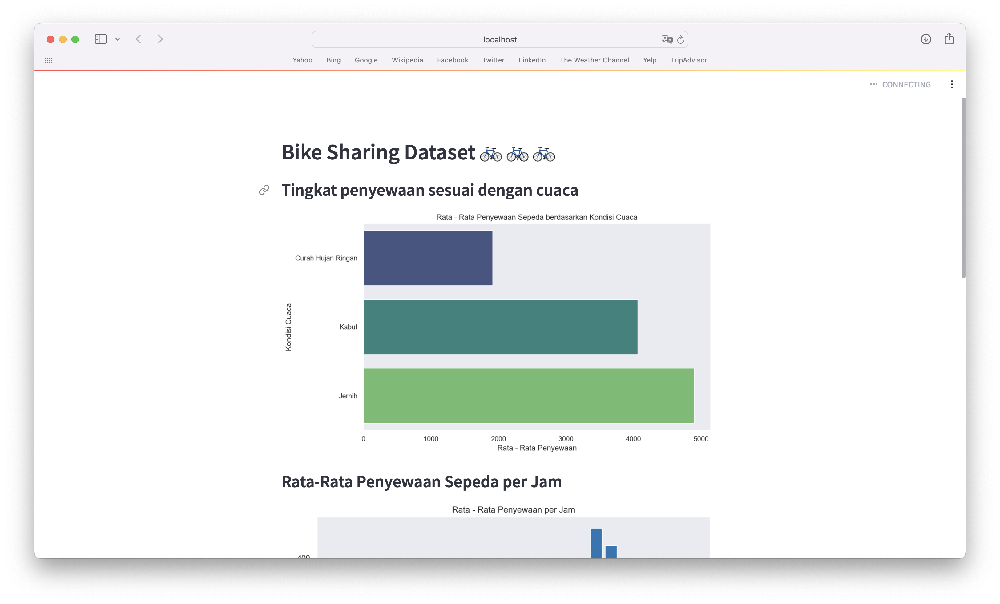

# Bike Sharing Dashboard 🚲

Welcome to the Bike Sharing Dashboard project! This dashboard provides visual insights into bike rental patterns using data from the Capital Bikeshare system in Washington D.C.

## Project Overview

Bike sharing systems are a modern alternative to traditional bike rentals, offering convenient and automated rental processes. This project aims to analyze and visualize bike rental data to understand rental patterns and their relationship with various factors such as weather conditions, holidays, and time of day.

## Features

- Visualize bike rental trends over time
- Explore the impact of weather conditions on rental patterns
- Analyze rental patterns by time of day and day of the week
- Investigate the influence of holidays on bike rental behavior

## Dataset

The dataset used in this project consists of two files:

- `hour.csv`: Bike sharing counts aggregated on an hourly basis
- `day.csv`: Bike sharing counts aggregated on a daily basis

## Dashboard Preview

(https://bit.ly/streamlit-dashboard-preview)

## Usage

To run the dashboard locally, follow these steps:

1. Install the required dependencies: `pip install -r requirements.txt`
2. Run the Streamlit app: `streamlit run dashboard.py`

## Deployment

The dashboard has been deployed to Streamlit Cloud. You can access it [here](dashboard_url).

## Technologies Used

- Python
- Pandas
- Matplotlib
- Seaborn
- Streamlit

## Feedback

If you have any feedback, suggestions, or issues, please feel free to open an issue or contact us. We'd love to hear from you!

Let's ride together! 🌞🚲
